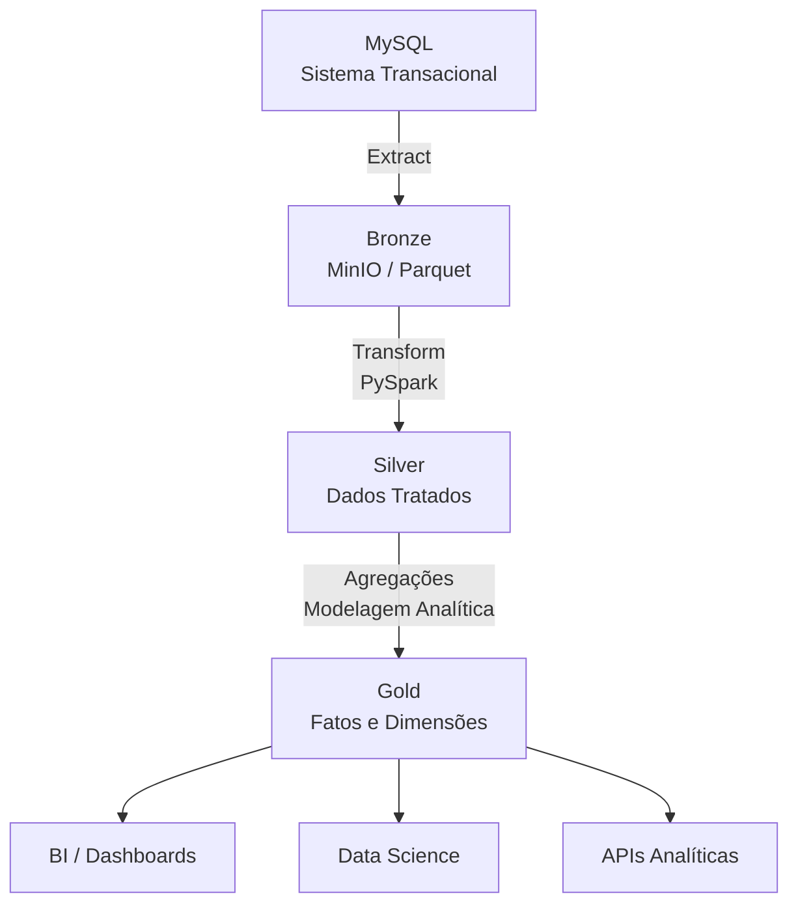

# Analytics ETL – Saúde


## Arquitetura de Dados



## Visão Geral
Este projeto implementa um **pipeline de dados analítico** seguindo boas práticas de Engenharia de Dados, utilizando **MySQL**, **PySpark**, **MinIO (S3 compatível)** e arquitetura **Medallion (Bronze, Silver e Gold)**.

O objetivo é extrair dados transacionais de um banco MySQL, persistir dados brutos no MinIO, realizar transformações com PySpark e gerar camadas analíticas prontas para consumo por BI, ciência de dados e APIs.

---

## Arquitetura de Dados

```
MySQL
  │
  ▼
Bronze (MinIO / Parquet)
  │
  ▼
Silver (PySpark / Dados tratados)
  │
  ▼
Gold (PySpark / Modelos analíticos)
```

### Camadas

- **Bronze**: dados brutos, espelho do MySQL, sem transformação de negócio.
- **Silver**: dados tratados, tipados, normalizados e prontos para modelagem.
- **Gold**: dados agregados e modelados (fatos e dimensões).

---

## Tecnologias Utilizadas

- **Python 3.11**
- **PySpark 3.5.1**
- **MySQL 8**
- **MinIO (S3 compatible)**
- **Docker / Docker Compose**
- **Parquet + Snappy**

---

## Estrutura do Projeto

```
analytics/
├── src/
│   ├── app/
│   │   ├── etl/
│   │   │   ├── extract.py        # MySQL → Bronze
│   │   │   ├── transform.py      # Bronze → Silver
│   │   │   └── gold.py           # Silver → Gold
│   │   └── saude/
│   │       └── analises/
│   │           └── scripts/
│   │               └── main.py   # Orquestração do ETL
│   ├── spark-warehouse/
│   └── logs/
├── venv/
├── .env
└── README.md
```

---

## Configuração do Ambiente

### 1. Ambiente Virtual

```bash
python -m venv venv
source venv/bin/activate
```

### 2. Dependências

```bash
pip install pyspark boto3 pandas python-dotenv mysql-connector-python sqlalchemy
```

---

## Variáveis de Ambiente (.env)

```env
# MySQL
MYSQL_HOST=localhost
MYSQL_PORT=3306
MYSQL_USER=root
MYSQL_PASSWORD=123456
MYSQL_DATABASE=analytics

# MinIO / S3
MINIO_ENDPOINT=http://localhost:9000
MINIO_USER=mauroslucios
MINIO_PASSWORD=P@SSWor4d!
AWS_REGION=us-east-1
MINIO_BUCKET=analytics
```

---

## Execução do Pipeline

### Spark Submit

```bash
spark-submit \
  --packages org.apache.hadoop:hadoop-aws:3.3.4 \
  app/saude/analises/scripts/main.py
```

---

## Camada Bronze

- Extração via **pandas + SQLAlchemy**
- Escrita em **Parquet** no MinIO
- Particionamento por data (`dt=YYYY-MM-DD`)

Exemplo:
```
s3a://analytics/bronze/consulta/dt=2026-01-17/consulta.parquet
```

---

## Camada Silver

- Leitura dos dados Bronze
- Padronização de tipos
- Renomeação de colunas
- Tratamento de datas
- Escrita em Parquet otimizado

Exemplo:
```
s3a://analytics/silver/consulta/
```

---

## Camada Gold

A camada Gold fornece **modelos analíticos prontos**.

### Modelo Fato – Consultas

**fato_consulta**
- id_consulta
- id_paciente
- id_medico
- id_doenca
- dt_consulta
- tempo_sintomas (dias)

### Dimensões

- **dim_paciente**
- **dim_medico**
- **dim_doenca**
- **dim_tempo**

Exemplo:
```
s3a://analytics/gold/fato_consulta/
s3a://analytics/gold/dim_doenca/
```

---

## Boas Práticas Aplicadas

- Arquitetura Medallion
- Dados imutáveis na Bronze
- Parquet + Snappy
- Particionamento temporal
- Logging estruturado
- Separação clara de responsabilidades

---

## Próximos Passos

- Implementar **Delta Lake**
- Criar **camada de métricas (KPIs)**
- Integração com **Power BI / Superset**
- Orquestração com **Airflow**
- Monitoramento de qualidade de dados

---

#### Camada Bronze no MinIO


#### Estrutura do Projeto e README

## Autor
- Mauro Lucio Pereira da Silva
## Conecte-se

[](https://www.instagram.com/luciospsilva/)
[](https://www.linkedin.com/in/mauro-lucio-pereira/)
[](https://www.facebook.com/mauroslucios)


Projeto desenvolvido para estudos avançados de Engenharia de Dados e Analytics aplicado à Saúde.

